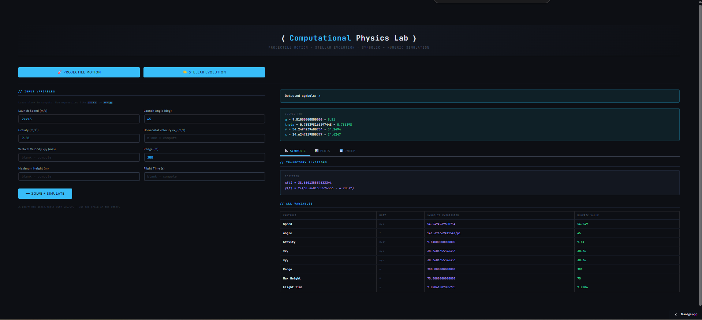
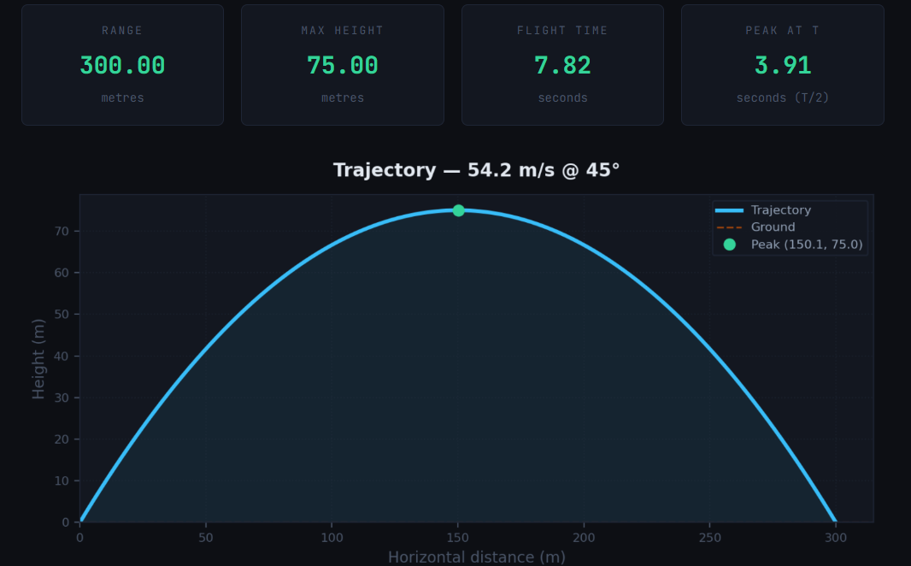
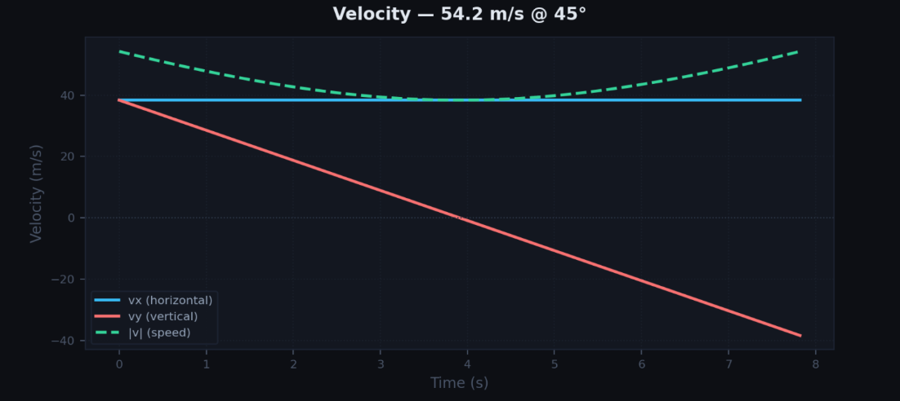
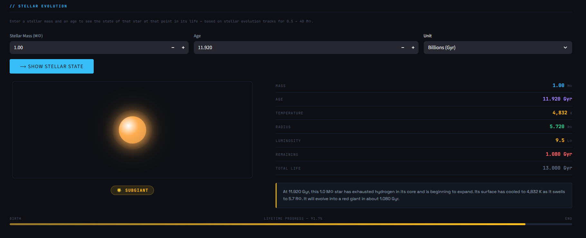

# Physim (Physics Simulator)

## Web App (app.py)

A browser-based interface for the physics lab built with Streamlit.

No installation is required — open the link and use it directly.

Users can enter any combination of the 8 projectile variables as numbers or
symbolic expressions (for example `2*x + 5`). Any remaining variables can be
left blank and the solver determines them automatically.

Results are displayed across three tabs:
- **Symbolic** — equations and variable table (symbolic + numeric values)
- **Plots** — trajectory and velocity graphs
- **Sweep** — parameter sweep plots when one symbol remains free

Live app:  
https://shree-physim.streamlit.app/

## Example Output

### Projectile Motion

### Stellar Evolution

# Computational Physics Lab

A small Python project for exploring classical physics systems using
numerical simulation, symbolic calculations, and data-driven models.

The goal is to run simple computational experiments, compute trajectories,
solve for unknown parameters, and visualize physical behavior.

## Tech Stack

Python · NumPy · SciPy · Matplotlib · SymPy · Streamlit

## Features

- ODE integration using `scipy.integrate.solve_ivp` (RK45)
- Projectile motion simulation with ground-impact event detection
- Accepts symbolic expressions as inputs (e.g. `2*x + 5`)
- Uses SymPy to solve for unknown variables when enough constraints are provided
- Displays both symbolic formulas and evaluated numeric values
- Terminal interface where variables can be left blank to compute them
- Browser interface built with Streamlit
- Parameter sweep plots when one symbol remains free
- Trajectory and velocity visualization using Matplotlib

## Systems Implemented

### Projectile Motion
A classical mechanics system modeled using differential equations.

The system computes projectile trajectories given any combination of
variables such as speed, angle, gravity, range, or flight time. When
enough constraints are provided, the symbolic solver determines the
remaining quantities before running the numerical simulation.

Outputs include:
- symbolic trajectory equations \(x(t)\) and \(y(t)\)
- computed physical quantities (range, maximum height, flight time)
- trajectory and velocity plots
- parameter sweep plots when a free variable remains

### Stellar Evolution
An astrophysics visualization system that shows the state of a star at a
given mass and age.

The model uses precomputed stellar evolution tracks for reference masses
between **0.5 and 40 solar masses**, derived from public stellar evolution
datasets such as MIST / Padova isochrones. When a user enters a mass that
falls between the reference tracks, the system interpolates between the
nearest tracks to estimate the star’s properties.

Given a stellar mass and age, the system computes and displays:

- effective temperature
- radius
- luminosity
- total lifetime
- remaining lifetime
- evolutionary stage

The web interface includes a visual representation of the star whose:

- **size** scales with stellar radius
- **color** approximates the blackbody temperature
- **pulse animation** scales with luminosity

Special visualizations are included for compact remnants and extreme
events such as neutron stars, black holes, and supernovae.

## Systems Implemented

- [x] Projectile Motion  
- [x] Stellar Evolution  
- [ ] Spring-Mass (planned)  
- [ ] Orbital Motion (planned)  
- [ ] Quantum / QFT related simulations (possible future work)

## File Structure

- `integrators.py`  — numerical ODE integration wrapper around `solve_ivp`
- `projectile.py`   — projectile motion equations and event detection
- `solver.py`       — SymPy-based symbolic equation handling
- `plots.py`        — plotting utilities using Matplotlib
- `main.py`         — terminal interface for running simulations
- `app.py`          — Streamlit web interface

## Notes

This project was developed as a learning exercise in computational physics.

AI tools were occasionally used for coding suggestions and debugging
during development.
